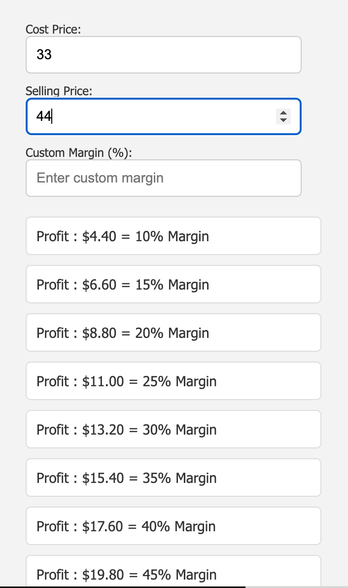
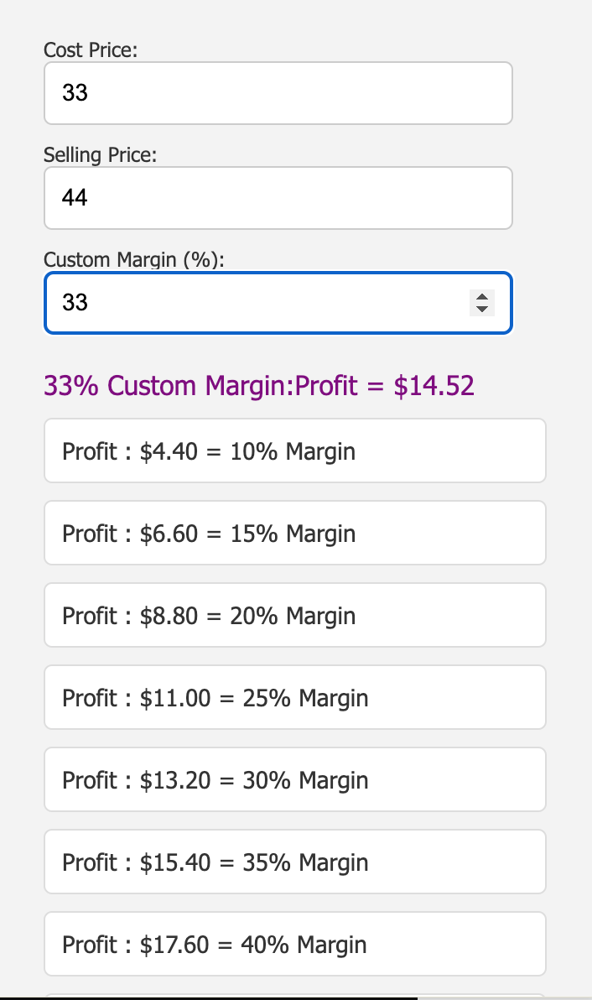

# Chrome Extension: Profit Calculator

## Overview

The **Profit Calculator** Chrome extension is a simple tool that allows users to calculate profit margins and custom profits based on selling and cost prices. It's designed to be user-friendly and provides real-time calculations.

## Features

- Calculate standard profit margins (10%, 20%, ..., 100%).
- Enter custom margin percentage and get calculated profit.
- Real-time updates as the user enters selling and cost prices.

## Installation

1. Clone this repository or download it as a ZIP file.
2. Open Chrome and navigate to `chrome://extensions/`.
3. Enable "Developer mode" in the top right.
4. Click on "Load unpacked" and select the extension directory.

## How to Use

1. Open the extension by clicking on its icon in the Chrome toolbar.
2. Enter the selling price and cost price in their respective input fields.
3. View real-time calculations for standard margins.
4. Optionally, enter a custom margin percentage to calculate custom profit.

## Screenshots

## Technologies Used

- HTML
- CSS
- JavaScript
- Chrome Extension API

## Credits

This Chrome extension is created by Muhammad Zahid [Ansarissab](https://github.com/Ansarissab). Feel free to contribute, report issues, or suggest improvements.

## License

This project is licensed under the [MIT License](LICENSE).
